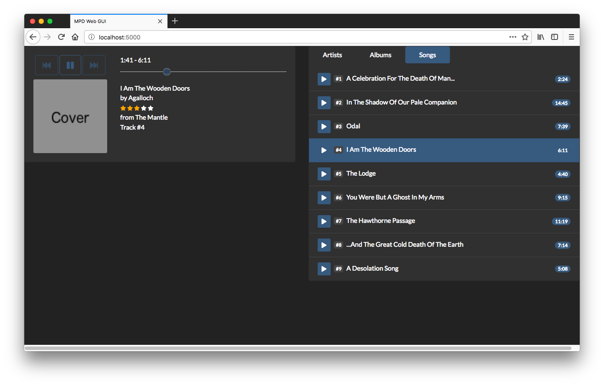

# MPD Web GUI
A flask server serving as a GUI for an MPD server

## Requierements
Here is an installation tutorial for OSX.

### MPD:
Install MPD:  
Via homebrew: `brew install mpd`

Configuration:
`vim ~/.mpdconf`

Example config:
```
# Required files
db_file            "~/.mpd/database"
log_file           "~/.mpd/log"

# Optional
music_directory    "~/Music"
playlist_directory "~/.mpd/playlists"
pid_file           "~/.mpd/pid"
state_file         "~/.mpd/state"
sticker_file       "~/.mpd/sticker.sql"
```

Optional: run mpd (will be started automatically): `mpd`

### Python

Create virtualenv: `virtualenv env`  
Activate virtualenv: `source env/bin/activate`  
Install dependencies: `pip install -r requirements.txt`  
Or manually: `pip install flask && pip install python-mpd2`

## Running server
`python player.py`

Then go to: [http://localhost:5000](http://localhost:5000)

## Screenshot


## What is working
* A very simple three pane music library (artists > albums > songs)
* Play a song with a click on the play arrow
* A status bar showing the current song (refreshes on song play/pause)
* Pause/resume a song from the status bar

## What needs to be done
* Implement a playlist
* Show album cover
* Better network implementation of status updates (e.g. socket communication)
* Show song progress

## In the far far future
* Change loudness of songs
* Play a random song
* Allow more complicated queries (like all songs to a genre)
* Make GUI more mobile friendly
* Implement more metadata like song rating
* Album art downloader with sharpening/resizing/contrast
* Lyrics downloader